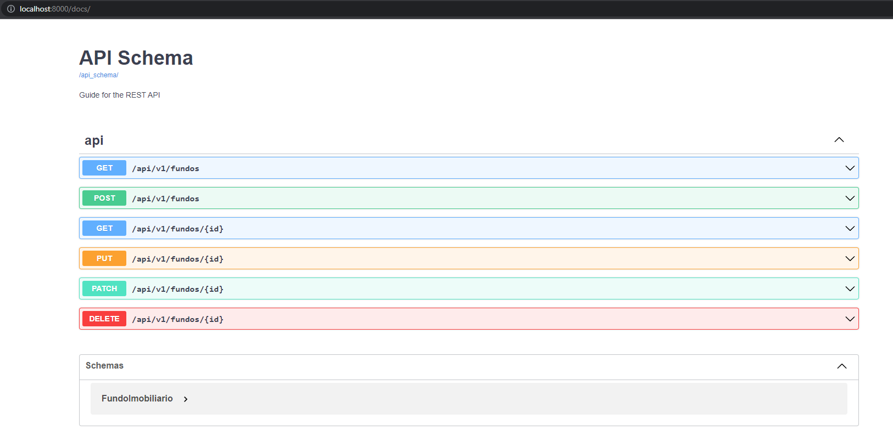

<h1>FundsFinder DRF API</h1> 

  
  
  

> Status do Projeto: concluído

### Tópicos 

:small_blue_diamond: [Descrição do projeto](#descrição-do-projeto)

:small_blue_diamond: [Funcionalidades](#funcionalidades)

:small_blue_diamond: [API](#API)

:small_blue_diamond: [Pré-requisitos](#pré-requisitos)

:small_blue_diamond: [Desenvolvedora](#Desenvolvedora)

## Descrição do projeto 

  Projeto backend realizado para aprender e praticar o uso do DRF e visualização com Swagger.

## Funcionalidades

:heavy_check_mark: Listar todos os Fundo Imobiliario  

:heavy_check_mark: Pesquisar Fundo Imobiliario por ID  

:heavy_check_mark: Cadastrar novo Fundo Imobiliario

:heavy_check_mark: Editar Fundo Imobiliario

:heavy_check_mark: Remover Fundo Imobiliario por ID

## API

## Pré-requisitos
Todas as dependencias estão listadas no arquivo requirement.txt e podem ser baixadas com o comando: pip install -r requirements.txt

:warning: [Django](https://docs.djangoproject.com/)

:warning: [Django Rest Framework](https://www.django-rest-framework.org/topics/documenting-your-api/)

:warning: [Django Rest Swagger](https://www.django-rest-framework.org/topics/documenting-your-api/)

:warning: [PyYAML](https://pyyaml.org/wiki/PyYAMLDocumentation)

## Desenvolvedora :

| [ Mayara Madeira Trevisol](https://github.com/mayara-mt) | 
|:--------------------------------------------------------------------------------------------------------------------------------------------------------------------------------------------------:|  
